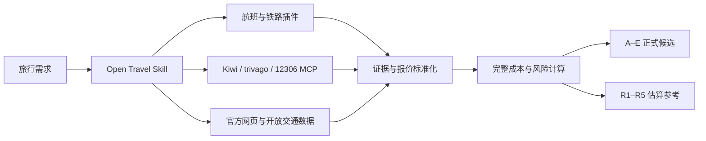

<div align="center">


# Open Travel

**面向 Codex 的开源旅行规划插件：聚合实时来源，统一证据，比较完整成本。**

[](https://developers.openai.com/plugins/)[](https://modelcontextprotocol.io/)[](https://www.python.org/)[](https://nodejs.org/)[](https://www.json.org/)[](#本地验证)[](./LICENSE)


Open Travel 将航班、铁路、住宿、活动、步道、公共交通、天气和汇率查询组织成一套可复用的旅行规划流程。它不会只展示最低票面价格，而是尽可能计算门到门完整成本，并明确标出税费、行李、接驳、住宿附加费和证据缺口。

> [!IMPORTANT]
> Open Travel 只负责查询、比较、解释和提供链接，不会代替用户预订、付款、取消订单或绕过登录、验证码、付费墙和访问限制。

## 目录

- [主要能力](#主要能力)
- [工作方式](#工作方式)
- [数据来源](#数据来源)
- [安装](#安装)
- [开始使用](#开始使用)
- [输出格式](#输出格式)
- [更新与卸载](#更新与卸载)
- [本地验证](#本地验证)
- [项目结构](#项目结构)
- [隐私与数据可信度](#隐私与数据可信度)
- [故障排查](#故障排查)
- [参与贡献](#参与贡献)
- [许可证](#许可证)

## 主要能力

- **跨来源查询**：根据日期和任务选择 Kiwi、Skyscanner、Trip.com、12306、trivago、Klook、Wikiloc 等可用来源。
- **全球地面交通**：优先使用结构化铁路、巴士和轮渡数据；覆盖不足时自动检索并核验当前运营商或交通机构的官方页面。
- **住宿比价**：通过 trivago 官方远程 MCP 查询，校验购物市场、语言、币种和目的地解析，并比较整段住宿总价。
- **完整成本**：合并票价、税费、行李、选座、出发地接驳、目的地接驳、住宿和必要附加费。
- **风险识别**：检查自助转机、分开出票、机场或车站变更、短衔接、深夜抵达、末班交通和入住截止时间。
- **证据标准化**：保存来源、查询时间、市场、币种、价格状态、税费与行李状态、完整性和错误代码。
- **稳定选项输出**：正式结果使用 `A–E`；数据不完整但存在合理估算范围时，单独使用 `R1–R5`，不与正式排名混排。
- **确定性计算**：本地 Python 代码只负责校验、组合、换算、风险评估与排名，不伪造实时价格。

## 工作方式



Open Travel 的重点不是制造更多搜索结果，而是把不同来源变成可以诚实比较的候选方案。未知值保留为未知，不使用 `0` 代替未返回的税费、行李或接驳成本。

## 数据来源

### 随插件提供

| 能力 | 实现方式 | 说明 |
|---|---|---|
| 中国铁路 | `npx -y 12306-mcp@0.3.9` | 固定版本的第三方 MCP 包；仅查询，不进入下单流程 |
| 航班 | `https://mcp.kiwi.com` | Kiwi 官方远程 MCP |
| 住宿 | `https://mcp.trivago.com/mcp` | trivago 官方远程 MCP |
| 天气 | Open-Meteo | 无密钥；只将预测称为预测 |
| 汇率 | Frankfurter，ECB 备用 | 央行参考汇率，不等于银行卡或现金成交价 |
| 公共交通 | Transitous / MOTIS | 开放时刻与路径数据，覆盖不均且通常不含可购买票价 |

### 可选增强插件

如果运行环境已安装并授权，Open Travel 还可以使用：

- Trip.com：固定日期航班、灵活日期航班及供应商覆盖范围内的铁路；
- Skyscanner：灵活日期和实时航班价格；
- Klook：活动、景点、餐饮与当地体验；
- Wikiloc：户外路线和步道。

这些插件不是安装 Open Travel 的硬性条件。缺少统一结构化来源时，Open Travel 会继续使用当前官方网页或开放数据，而不是把“供应商未覆盖”误报为“线路不存在”。

## 安装

### 系统要求

- Codex CLI，或支持插件的 ChatGPT 桌面应用；
- Git；
- Python 3.10 或更高版本；
- Node.js 与 `npx`，用于启动 12306 MCP；
- 能访问所选旅行数据提供商的网络环境。

可以先检查本机环境：

```bash
codex --version
git --version
python --version
node --version
npx --version
```

> [!NOTE]
> 仓库不需要执行 `pnpm install` 或在项目内安装 `node_modules`。12306 MCP 由 `npx` 按固定版本启动。

### 方法一：克隆后从本地安装

```bash
git clone https://github.com/<OWNER>/open-travel.git
cd open-travel
codex plugin marketplace add .
codex plugin add open-travel@open-travel
```

这里的 `.` 必须是包含 `.agents/plugins/marketplace.json` 的仓库根目录。

### 方法二：通过 ChatGPT 桌面应用安装

1. 克隆或下载本仓库；
2. 将仓库根目录作为项目打开；
3. 重启 ChatGPT 桌面应用；
4. 打开 **Plugins**；
5. 在 Marketplace 来源中选择 **Open Travel**；
6. 打开插件详情并点击加号安装；
7. 新建任务后开始使用。

Codex 官方插件文档：[构建与分发插件](https://developers.openai.com/plugins/build/plugins) · [使用插件](https://learn.chatgpt.com/docs/plugins)

## 开始使用

直接描述旅行需求：

```text
帮我规划 8 月 15 日从上海到大阪的 5 天游。
1 位成人，含 20kg 托运行李，住宿预算每晚 700 元以内。
给出 A–E 方案，并比较完整成本、门到门时间和风险。
```

也可以显式调用 Skill：

```text
使用 $plan-open-travel，比较北京到首尔固定日期和前后两天出发的方案。
```

更多示例：

```text
规划新加坡到曼谷的铁路、巴士和航班方案，没有统一数据源时核验运营商官网。
```

```text
审计这份行程：检查分开出票、行李、末班交通、酒店入住截止时间和所有未知费用。
```

```text
只比较 A 和 C，并告诉我哪些价格需要重新查询。
```

## 输出格式

正式结果通常包含三到五个不重复候选：

| ID | 定位 |
|---|---|
| A | 综合推荐 |
| B | 最低完整成本 |
| C | 最快门到门 |
| D | 最少折腾 |
| E | 舒适优先 |

同一方案可以同时获得多个标签，但不会为了凑够五项而重复展示。

只有完整、合格且证据足够的方案才能进入正式 `A–E` 排名。当关键费用缺失但存在可解释的估算上下界时，Open Travel 会在独立的 `R1–R5` 区域展示“已知成本 + 估算区间”，并列出仍然未知的字段。

## 更新与卸载

### 更新本地克隆

```bash
git pull
codex plugin add open-travel@open-travel
```

随后重启桌面应用或新建 Codex 会话。

### 卸载

```bash
codex plugin remove open-travel@open-travel
```

如不再需要该 Marketplace：

```bash
codex plugin marketplace remove open-travel
```

## 本地验证

运行离线契约和计算测试：

```bash
python -m unittest discover -s tests
```

测试覆盖：

- 插件与 Marketplace 结构；
- 完整成本计算；
- 严格排名与估算参考分离；
- 跨来源证据和错误规范化；
- 行李“包含 / 不含 / 未知 / 未返回”的区分；
- trivago 市场、语言和目的地解析契约；
- 天气预测窗口；
- Frankfurter 与 ECB 汇率备用路径；
- Transitous 路径结果。

实时价格、库存和第三方服务可用性不会作为离线测试的稳定断言。

## 项目结构

```text
.
├── .agents/
│   └── plugins/
│       └── marketplace.json
├── assets/
│   └── open-travel-pixel.svg
├── plugins/
│   └── open-travel/
│       ├── .codex-plugin/
│       │   └── plugin.json
│       ├── .mcp.json
│       └── skills/
│           └── plan-open-travel/
│               ├── agents/
│               ├── references/
│               ├── scripts/
│               └── SKILL.md
├── tests/
├── LICENSE
└── README.md
```

## 隐私与数据可信度

- 查询内容会发送给实际使用的旅行数据提供商，其服务条款和隐私政策分别适用。
- Open Travel 不保存密码、身份证件、付款信息或浏览器会话。
- 不绕过验证码、登录、robots 规则、付费墙或限流。
- 动态价格会记录来源和查询时间；历史结果不会被包装成当前实时价格。
- `live`、`recent`、`estimated` 和 `unavailable` 会明确区分。
- 缺失税费、行李、清洁费、城市税或接驳费用时，总价保持不完整。
- 最终购买前应在实际销售方页面重新确认库存、币种、税费、行李和退改规则。

## 故障排查

### 插件没有出现

```bash
codex plugin marketplace list
codex plugin list --json
```

确认 Marketplace 指向仓库根目录，然后重启桌面应用或 CLI，并新建任务。

### 价格无法进入正式排名

这通常意味着税费、行李、住宿、接驳或币种换算仍有关键缺口。查看 `R1–R5` 估算参考和缺失字段，或要求重新查询指定部分。

## 参与贡献

欢迎提交 Issue 和 Pull Request，尤其是：

- 新的官方、可公开配置且无需泄露凭据的 MCP 来源；
- 可复现的供应商契约问题；
- 新地区的开放交通数据覆盖；
- 报价规范化、完整成本和风险规则改进；

贡献新数据源时，请同时说明：

1. 来源所有者和官方文档；
2. 鉴权、市场、币种与调用限制；
3. 返回字段及缺失字段；
4. 错误分类；
5. 至少一个成功、空结果和失败用例；
6. 为什么该来源适合开源分发。

## 许可证

本项目使用 [MIT License](./LICENSE)。

